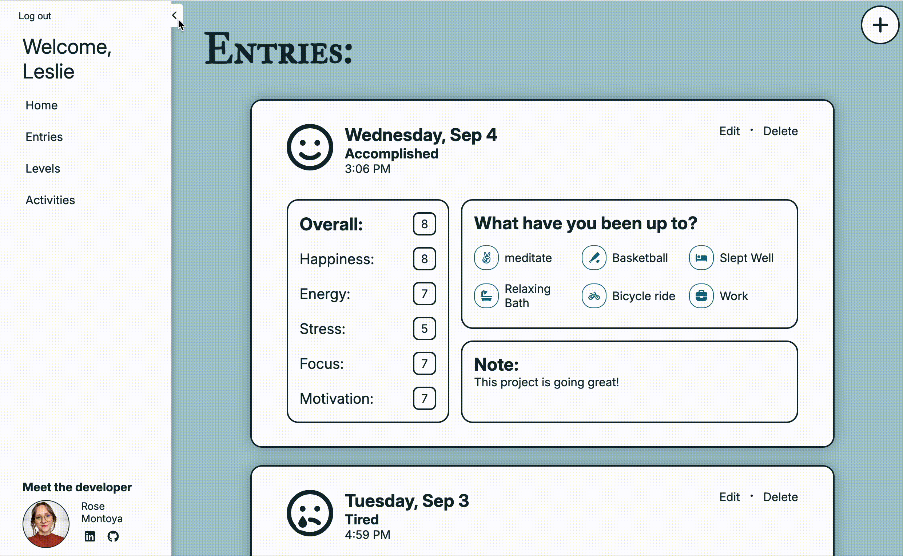

# Luna

Luna is a web application made to help a user track and organize their life. Luna was inspired by my own personal journey and usage of many mood trackers, habit trackers and journals, with [daylio][daylio-link] being the biggest source of inspiration. I wanted to create a site that combined  my favorite features from different apps I've used over the years. Plus the additional freedoms I've always wanted from them. All combined in an orginized, stylish, and easy to use format. I hope you enjoy Luna!

Check out the live version Luna here:
[Luna][luna-live-link]

[luna-live-link]: https://luna-aa-capstone.onrender.com/
[daylio-link]: https://daylio.net/

## Index
* [Wiki](https://github.com/RoseMontoya/Luna-AA-Capstone/wiki)
  * [Database Schema](https://github.com/RoseMontoya/Luna-AA-Capstone/wiki/DB-Schema)
  * [API Documentation](https://github.com/RoseMontoya/Luna-AA-Capstone/wiki/API-Documentation)
  * [User Stories](https://github.com/RoseMontoya/Luna-AA-Capstone/wiki/User-Stories)
  * [Frontend Routes](https://github.com/RoseMontoya/Luna-AA-Capstone/wiki/Frontend-Routes)
  * [Redux Store](https://github.com/RoseMontoya/Luna-AA-Capstone/wiki/Redux-Store)
* [Feature List](#feature-list)
* [Technologies](#technologies)
* [Screenshots](#screenshots)
* [Set Up](#setup-instructions)

## Feature List

- ### Implemented Features

  * ### Entries

    * **Description:** The entries feature includes the ability to create, read, update, and delete an entry. An entry is comprised of the date, a mood (such as happy, sad, frustrated, ect), a rating that represents the users overall mood, and an optional note. Each entry can also include levels, a scale rating such as energy, happiness, ect, and/or activities.
      * Entries can be made for the current day or any day in the past.
      * Multiple entries can be added to a day.
    * [**Screenshots**](#entries-1)
    * **Planned Improvements:**
      * ability to search for specific entries
      * addition of specific moods, so that moods can be added, updated or removed as a seperate feature. A specific mood will have a name, color, and icon associated with it.
      * sorting of entries by month
      * entries of the same day linked visually

  * ### Activities
    * **Description:** The activities feature includes the ability to create, read, update, and delete an activity. An Activity is comprised of two parts: the name of the activity and the icon to represent it. A user can add/edit activities from two spots: the entry form page and the activities page.
    * [**Screenshots**](#activities-1)
    * **Planned Improvements:**
      * ability to deactivate an activity instead of only deleting it.
      * ability to sort and catorgize activities.
      * ability to search for an activity

  * ### Levels
    * **Description:** The levels feature includes the ability to create, read, update, and delete a level. A level allows a user to keep track of items that are on scale, such as happiness, energy, ect. A level itself if comprised of a name, and can be given a rating on an individual entry.
      * Eventually, levels will be assigned a color to be associated with. This will be added for the mood chart feature, in which levels will be displayed on a line chart and the color will represent the level.
    * [**Screenshots**](#levels-1)
    * **Planned Improvements:**
      * ability to deactivate a level instead of only deleting it.

- ### Future Features

  * **Journal**
    * This feature will allow users to add longer text entries. It will also include different journaling prompts for users to use.
  * **Habit**
    * This feature will allow the user to tracker certain habits. Will probably have some sort of integration with entries and activities. Also, want to include helpful notes on how to best establish a habit and encouragement.
  * **Mood Chart**
    * This feature will display information associated with entries, activities, and levels. It will include a line chart of how levels change over time and include correlation of levels to activities or other levels.
  * **Albums**
    * This feature will add in the ability for a user to add in images for entries. It will have a seperate page in which a user can view all of the images they have added and they can be organized into seperate albums.
  * **Goals**
    * This feature will allow users to set goals and keep progress of it. It will provide helpful tips on how to achieve goals. It will include an integration into entries.
  * **Categories**
    * This feature will allow users to group activities by categories so they are easier to find and organize.
  * **Moods**
    * This feature will seperate out mood from entry so there are specified moods. Each mood will have an associated name, color and icon.

## Technologies

  1. **React** for building a single-page application and creating reusable components.
  2. **Redux** for centralized state management across the app.
  3. **Node.js** for its non-blocking architecture and easy code modifications.
  4. **Express.js** for building a RESTful API and handling HTTP requests efficiently.
  5. **Sequelize** for interacting with relational databases and managing database models securely.
  6. **PostgreSQL/SQLite** as databases for local development and deployment.
  7. **CSS Grid/Flex** for dynamic and visually organized layouts.

## Screenshots
**Landing Page** 

### Entries
**Home Page** 

**Entries Page** 

**Entry Details Page** 

**Entry Form Page**

**Delete Entry Modal** 

### Levels

**Levels Page** 

### Activities

**Activities Page** 

**Activity Modal** 

**Delete Activity/Level Modal** 

<!-- ## Setup Instructions -->
<!-- npm start  to start up backend
npm run dev to start up frontend -->
