# Luna-AA-Capstone

Luna is a web application made to help a user track and organize their life. Luna was inspired by my own personal journey and usage of many mood trackers, habit trackers and journals, with [daylio][daylio-link] being the biggest source of inspiration. I wanted to create a site that combined  my favorite features from different apps I've used over the years. Plus the additional freedoms I've always wanted from them. All combined in an orginized, stylish, and easy to use format. I hope you enjoy Luna!

Check out the live version Luna here:
[Luna][luna-live-link]

[luna-live-link]: https://luna-aa-capstone.onrender.com/
[daylio-link]: https://daylio.net/

## Index
* [Wiki](https://github.com/RoseMontoya/Luna-AA-Capstone/wiki)
  * [Database Schema](https://github.com/RoseMontoya/Luna-AA-Capstone/wiki/DB-Schema)
  * [API Documentation](https://github.com/RoseMontoya/Luna-AA-Capstone/wiki/API-Documentation)
  * [User Stories](https://github.com/RoseMontoya/Luna-AA-Capstone/wiki/User-Stories)
  * [Frontend Routes](https://github.com/RoseMontoya/Luna-AA-Capstone/wiki/Frontend-Routes)
  * [Redux Store](https://github.com/RoseMontoya/Luna-AA-Capstone/wiki/Redux-Store)
* [Feature List](#feature-list)
* [Technologies](#technologies)
* [Screenshots](#screenshots)

## Feature List

- ### Implemented Features

  * ### Entries

  * ### Activities

  * ### Levels

- ### Future Features

  * **Journal**
  * **Habit**
  * **Mood Chart**
  * **Albums**
  * **Goals**
  * **Categories**

## Technologies

## Screenshots
**Landing Page** 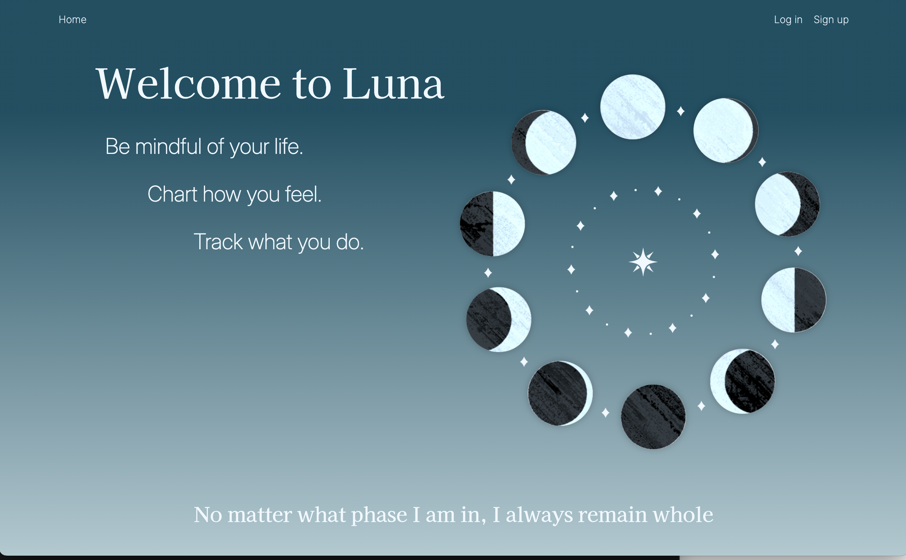

**Home Page** 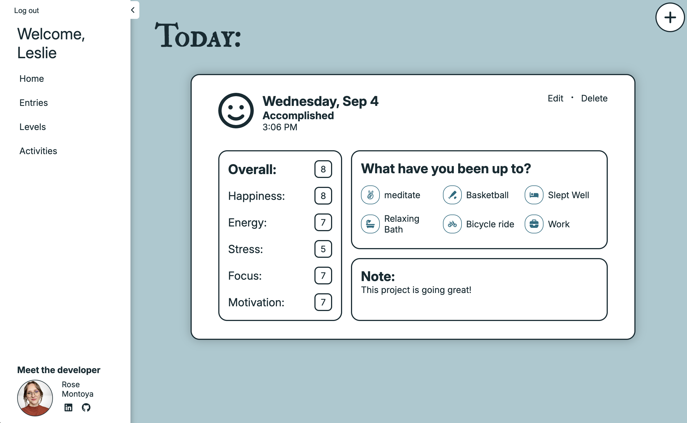

**Entries Page** 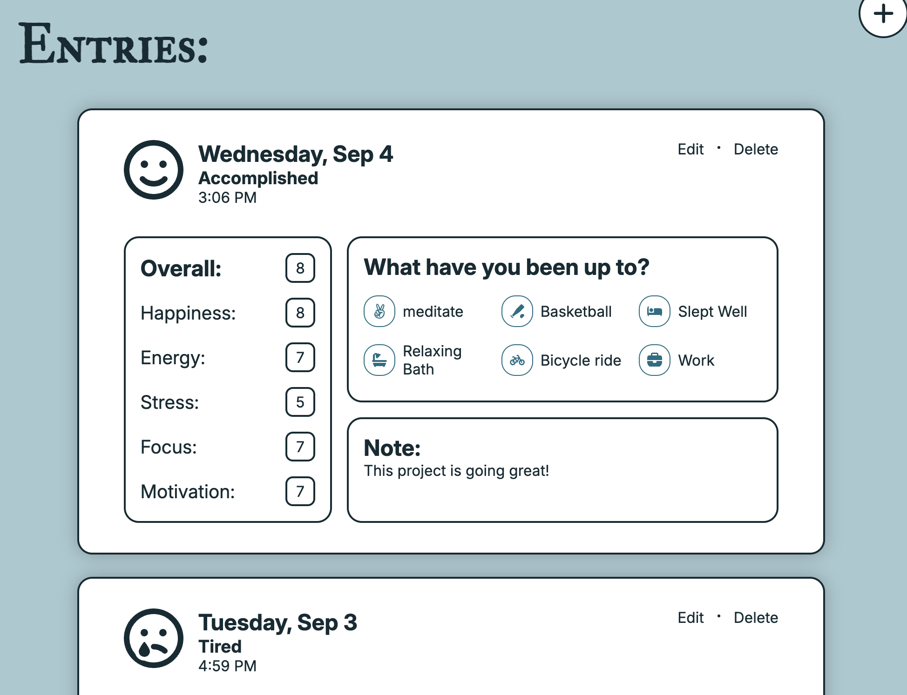

**Entry Details Page** 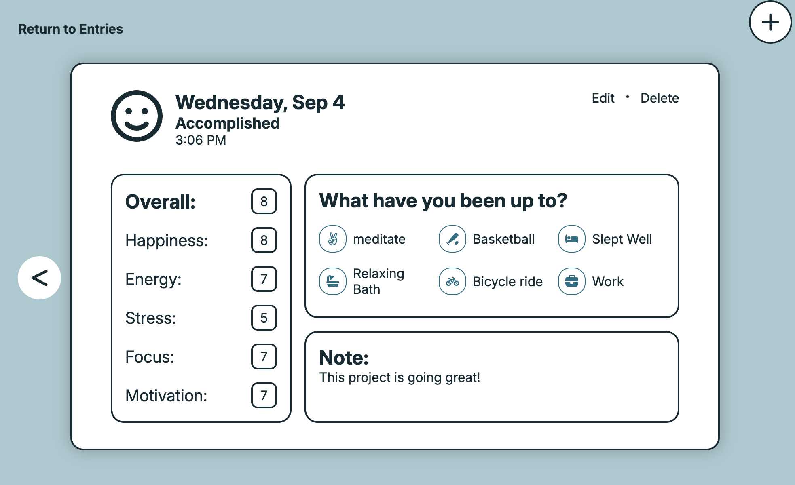

**Entry Form Page**
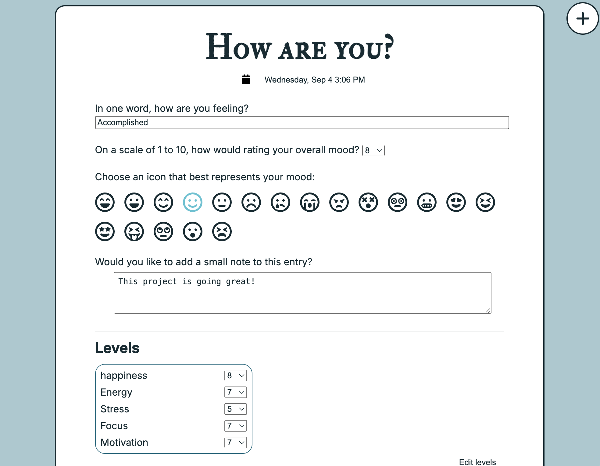
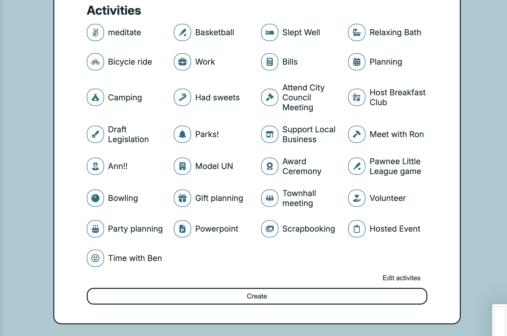

**Levels Page** 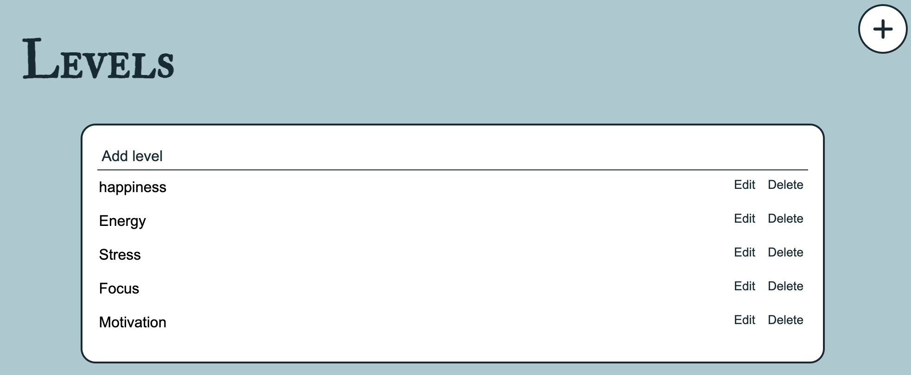

**Activities Page** 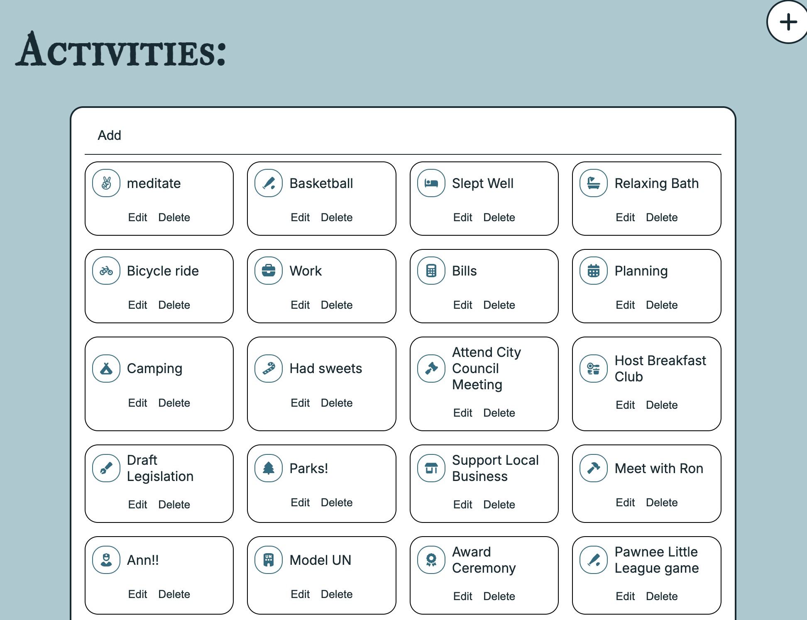

**Activity Modal** 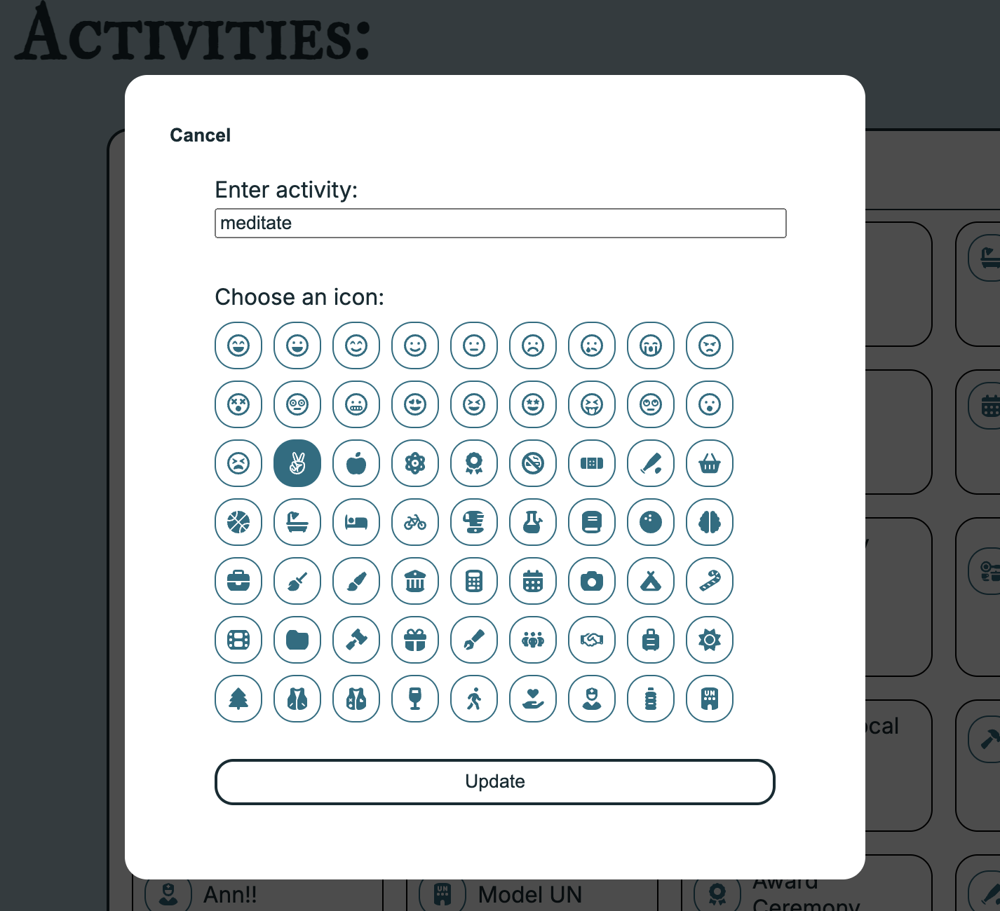

**Delete Activity/Level Modal** 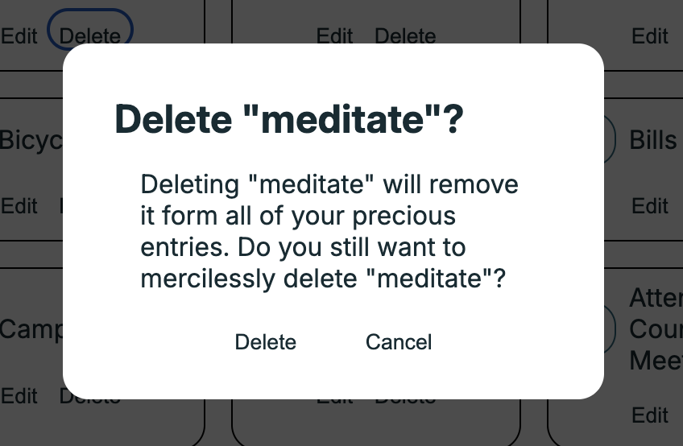

**Delete Entry Modal** 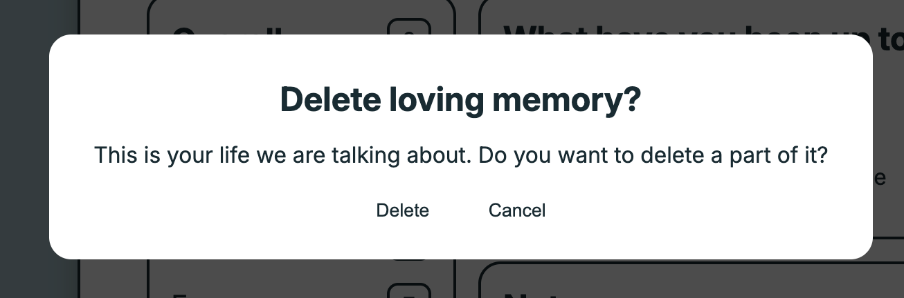
